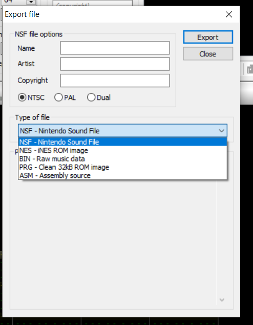

# Changing Sound effects

Sound effects are a key part of most games - they are something players don't really consciously think about, but they
make certain things much more obvious. If you picked up an item in an RPG, you'd be surprised if you didn't hear some
sort of sound. So, how can you add sounds to your game? Let's find out!

## Creating new sounds

Much like creating music, sound effects are created with Famitracker. Famitracker should have been installed as part of
chapter 1. If you do not have it installed, go get it from the [Famitrack website](http://famitracker.org) now.

If you have not gone through the tutorial from the music section, here it is again: 
[How to use Famitracker](http://btothethree.tumblr.com/post/104644129447/how-to-use-famitracker-chapter-1-introduction)

Creating the actual sound effects is outside the scope of this tutorial - the linked Famitracker tutorial can help. I
have found that using instruments to create a sound effect works well. I create an instrument I like, enter one note
of it as the sound effect, then enter a rest note (`-`) a line or two later and that's that.

Sound effects for the example game are stored in `sound/sfx/sfx.ftm`, and it's easiest to keep using this file.

There are a few special things you have to do with sound effects to make them work with the sfx library we use
(famitone2): 
- Sound effects should generally be short, as there is a size limit (255 bytes) to the sound effect data
- Famitracker effects such as slides are allowed, but may quickly increase the size of the effect
- DCPM cannot be used
- Expansion audio is not supported (for the same reasons as with music)

If you followed the instructions in the music chapter, you will generally want to use "Pulse 2" for your sound
effects. This way, they will not interrupt the most interesting part of your music when played. (Sound effects
interrupt music on all channels that they use!)

## Importing sound effects into the game engine

Once you have a few sounds you like in famitracker, you need to do an export to get them into your game. This
will be really similar to what you did with music, but the type changes. Note that this process is _manual_, and
you have to remember to do this any time you want to update your game's sound effects.

You're presumably already editing `sound/sfx/sfx.ftm` in famitracker - we need to save this file into a format
our game recognizes, as it does not understand .ftm files. In the famitracker ui go to the `File` menu,
and choose `Create nsf...` You should see a screen like this: 



From the dropdown, select "NSF - Nintendo Sound File" (NOTE: This is different to what you had to do with music!)
You can also enter some information about your game on this screen. Next, hit "Export" and you will get a file save
dialog. Save this file as `sound/sfx/sfx.nsf`.

That should be all there is to it. If you rebuild your game, it should have your new music available. If you
replaced one of the built-in sfx, you will be able to hear it immediately. If not, read on...

## Playing custom sound effects

Okay, you have some new sound effects ready to go; let's get them into your game! The process is very similar to
what we did with music - there is just one function to call when you want a sound effect to start playing. 
As an example, we will walk through adding a sound effect for when the game is paused. Note that you could put
this logic anywhere, though.

First, we need to tell the engine how to find our new effect. Sound effects are defined in
`source/configuration/system_constants.h`. Look for definitions like this: 

```c
// Constants for sound effects we play in the game
#define SFX_HURT 0
// ... more
#define SFX_WIN 4
```

Each "song" shown in the Famitracker song list should have an entry here. If you added a new sound effect after the
"win" sound, it would get a number of `5`. Add a new define for the new sound effect, as `SFX_PAUSE`. If you have
not added a new sound, you can reuse a number between 0 and 4 instead. The result should look like this: 

```c
#define SFX_PAUSE 5
```

While you're in this file, also be aware of the constants for `SFX_CHANNEL_1` through `SFX_CHANNEL_4`. You will
use these constants to give your sound effects "priority". If two sounds are playing at the same time, the one
with the lower priority number will play over the one with higher priority. (If you don't really care, you can
also just use `SFX_CHANNEL_1` for everything. Priority is nice to have, though.)

Next, we need to use it somewhere. We are trying to add a pause sound effect, so let's find where we trigger
the pause menu. This happens to be in `source/sprites/player.c`, in the `handle_player_movement()` method. 
Right at the top, you should see some logic like this: 

```c
// If Start is pressed now, and was not pressed before...
if (controllerState & PAD_START && !(lastControllerState & PAD_START)) {
    gameState = GAME_STATE_PAUSED;
    return;
}
```

This is the perfect home for our sound! We use the `sfx_play(sound id, priority)` method to do it. The sound
id is the constant we called `SFX_PAUSE`, and the priority is one of `SFX_CHANNEL_1` to `SFX_CHANNEL_4`. Here's
the end result: 

```c
// If Start is pressed now, and was not pressed before...
if (controllerState & PAD_START && !(lastControllerState & PAD_START)) {
    gameState = GAME_STATE_PAUSED;
    sfx_play(SFX_PAUSE, SFX_CHANNEL_1);
    return;
}
```

If you build your game and play it, pausing the game should now trigger the new pause sound effect.
